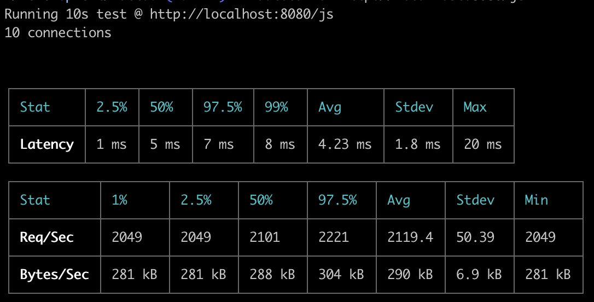
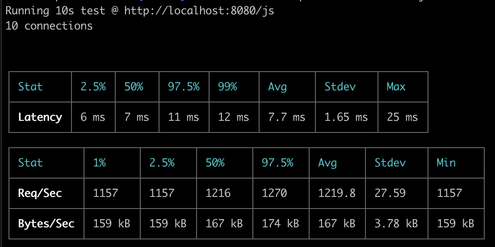
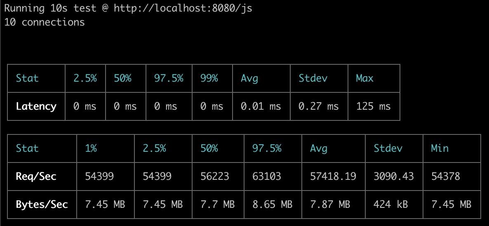
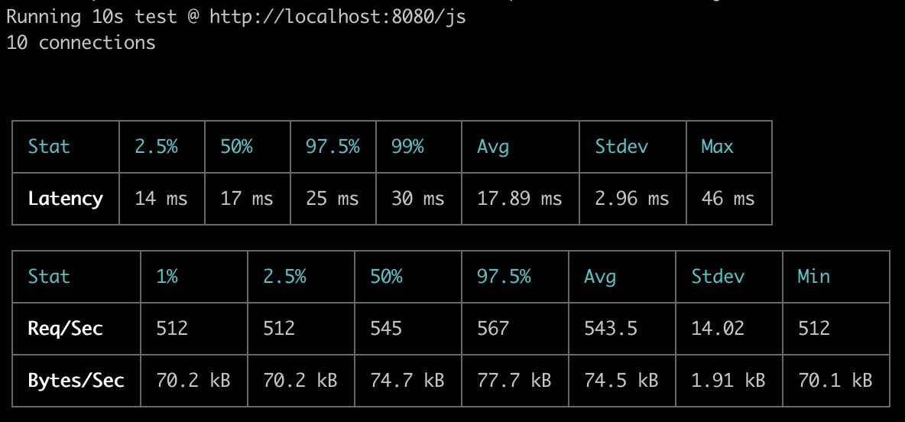
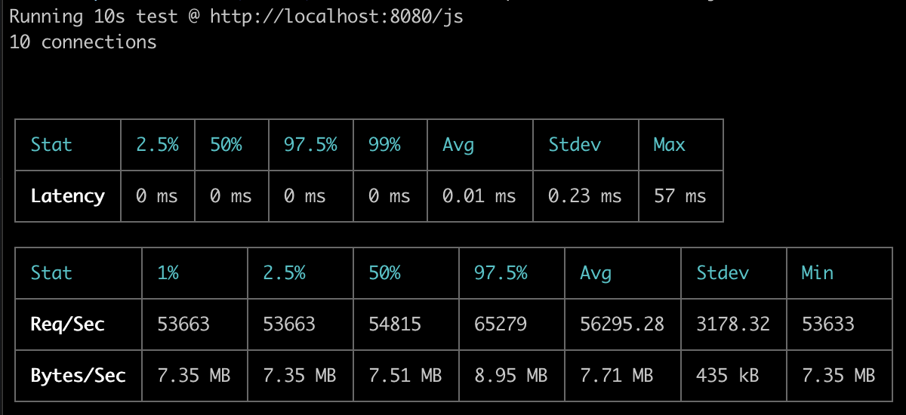

# Deno Runtime in Web Server

A place for testing stuffs related to embedding deno in a Rust Web Server.

## Current Thoughts

- Initialization of `MainWorker` and `JsRuntime` are much to slow to be done on a per-request basis
- Creating a new `v8::Isolate` for every request may also be overkill and is slower than reusing the same isolate (even with just `v8`)
- Reusing a single `MainWorker` or `JsRuntime` instance for each request provides significantly better performance, but creates a memory leak (not smart enough at Deno or v8 to understand this behavior fully)
- Wondering if it is possible to reset the `v8::Isolate` so that a new one doesn't need to be created?
- If it is possible to reuse a single isolate for a given endpoint, may also be sweet to have that script `v8::Script::compile`d only once?

## v8

Current average latency for `v8` with creation of a new `v8::Isolate` on every request is 4.23ms



## JsRuntime

Current average latency for `JsRuntime` with creation of new `JsRuntime` on every request is 7.7ms, and shared `JsRuntime` is 0.27ms





## MainWorker

Current average latency for `MainWorker` with creation of new `MainWorker` on every request is 17.89ms, and shared `MainWorker` is 0.23ms





## Running Benchmarks

```bash
npm i

## START SERVER (pick one command to run)
## v8
npm run v8

## JsRuntime
npm run js_runtime

## JsRuntime (shared)
npm run js_runtime_shared

## MainWorker
npm run main_worker

## MainWorker (shared)
npm run main_worker_shared

## BENCHMARK
npm run autocannon
```